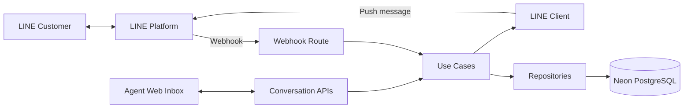
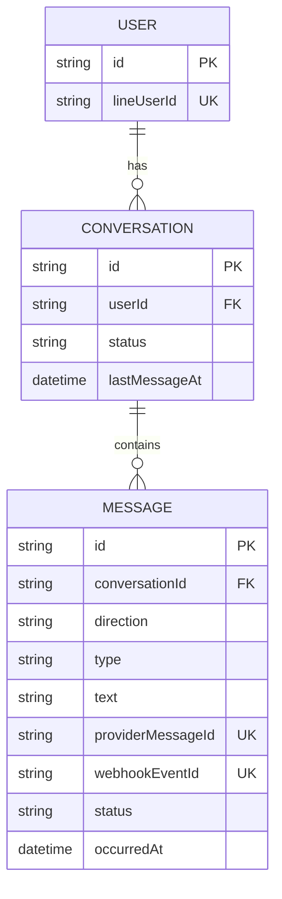

# Web Chat

## MVP Scope

สิ่งที่รวมอยู่ใน MVP:

- รับ LINE webhook และ verify signature
- รองรับข้อความประเภท text
- ป้องกันการ process webhook event ซ้ำ
- persist ข้อมูล User, Conversation และ Message
- แสดง conversation list และ message history
- ส่งข้อความตอบกลับผ่าน LINE Messaging API
- บันทึก outbound message status
- sync ข้อมูลบน browser ด้วย short polling
- ใช้ PostgreSQL บน Neon และ deploy application บน Vercel

สิ่งที่ยังไม่อยู่ในขอบเขต ได้แก่ authentication, การมอบหมายหลายเจ้าหน้าที่, ข้อความประเภท media, read receipt, typing indicator, search, queue, retry worker และ WebSocket/SSE

## Tech Stack

| ส่วนงาน | เทคโนโลยี |
| --- | --- |
| Frontend | Next.js 16 App Router, React 19, Tailwind CSS 4 |
| Backend | Next.js Route Handlers |
| Language | TypeScript |
| ORM | Prisma 7 |
| Database | PostgreSQL บน Neon |
| PostgreSQL driver | `pg` ผ่าน `@prisma/adapter-pg` |
| Messaging provider | LINE Messaging API |
| Browser synchronization | Short polling |
| Unit testing | Vitest |
| Deployment | Vercel |

## Architecture

Next.js application เป็นศูนย์กลางระหว่างหน้าเว็บของเจ้าหน้าที่ LINE และ PostgreSQL โดย frontend จะไม่ติดต่อ LINE โดยตรง และไม่รับข้อมูลจาก webhook โดยตรง



Database เป็นแหล่งข้อมูลหลักของระบบ:

```text
LINE webhook -> backend -> database -> API polling -> agent UI
```

### Responsibilities

| ส่วน | Responsibility |
| --- | --- |
| `src/app` | UI และ HTTP transport |
| `src/use-cases` | Application workflows และ business decisions |
| `src/integrations/line` | Integration และ data mapping ระหว่างระบบกับ LINE |
| `src/repositories` | อ่านและ persist ข้อมูล |
| `src/db` | Prisma configuration และ PostgreSQL connection |
| `src/models` | Internal models ที่ไม่ผูกกับ LINE โดยตรง |

ทิศทาง dependency หลัก:

```text
Route Handler -> Use Case -> Repository -> Prisma -> PostgreSQL
                         \-> LINE Client -> LINE Platform
```

## Core Workflows

### Inbound Message

```text
LINE webhook
  -> verify signature
  -> map เป็น internal event
  -> deduplicate event
  -> persist User, Conversation และ Message
  -> UI sync ข้อมูลผ่าน polling
```

### Outbound Message

```text
Agent ส่งข้อความ
  -> persist ข้อความเป็น PENDING
  -> ส่งผ่าน LINE Messaging API
  -> update เป็น SENT หรือ FAILED
```

การเรียก LINE API จะอยู่นอก database transaction เพื่อไม่ให้เปิด transaction ค้างระหว่างรอ external service

## Domain Model



Domain invariants ที่สำคัญ:

- ผู้ใช้หนึ่งคนมีประวัติหลายบทสนทนาได้ แต่มีบทสนทนาที่ `ACTIVE` ได้ครั้งละหนึ่งรายการ
- ข้อความขาเข้าใช้สถานะ `RECEIVED`
- ข้อความขาออกเปลี่ยนจาก `PENDING` เป็น `SENT` หรือ `FAILED`
- `webhookEventId` ใช้ deduplicate event
- `lastMessageAt` ใช้ sort conversation list ตาม activity ล่าสุด
- MVP รองรับเฉพาะข้อความประเภท `TEXT`

## API Surface

| Method | Endpoint | Purpose |
| --- | --- | --- |
| `POST` | `/api/line/webhook` | รับ LINE webhook |
| `GET` | `/api/conversations` | แสดง conversation list |
| `GET` | `/api/conversations/:conversationId/messages` | แสดง message history |
| `POST` | `/api/conversations/:conversationId/messages` | ส่งข้อความตอบกลับจาก Agent |

## Project Structure

```text
prisma/
└── schema.prisma

src/
├── app/
│   ├── api/
│   │   ├── line/webhook/route.ts
│   │   └── conversations/
│   │       ├── route.ts
│   │       └── [conversationId]/messages/route.ts
│   └── ... frontend pages and components
├── db/
│   ├── client.ts
│   └── generated/prisma/
├── integrations/line/
├── models/
├── repositories/
└── use-cases/
```

โครงสร้างนี้คือเป้าหมายที่ผ่านการออกแบบแล้ว แต่ directory จะถูกเพิ่มทีละส่วนตาม checklist ที่ผ่านการรีวิว

## Development Setup

สิ่งที่ต้องมี:

- Node.js 20.19 ขึ้นไป
- PostgreSQL database
- LINE Messaging API channel

ติดตั้ง dependencies:

```bash
npm install
```

คัดลอกไฟล์ environment variables และใส่ credentials:

```bash
cp .env.example .env.local
```

ตัวแปรที่ระบบต้องใช้:

```dotenv
DATABASE_URL="postgresql://..."
LINE_CHANNEL_SECRET="..."
LINE_CHANNEL_ACCESS_TOKEN="..."
```

ตัวแปรเหล่านี้ใช้เฉพาะฝั่ง server ห้ามเติม `NEXT_PUBLIC_` และห้ามนำไปใช้ใน browser code

สร้าง Prisma Client:

```bash
npm run prisma:generate
```

สร้าง development migration หลังจาก database change ผ่าน review:

```bash
npm run prisma:migrate -- --name init
```

เริ่ม development server:

```bash
npm run dev
```

## Testing และ Verification

```bash
npm run prisma:validate
npm run typecheck
npm run lint
npm test
npm run build
```

Automated tests ใน assignment นี้เน้นเฉพาะ:

- LINE signature verifier
- LINE webhook adapter
- Use cases

Repository, Prisma และ live database integration tests ยังไม่อยู่ใน scope โดยจะ verify database behavior ผ่าน migration และ manual/end-to-end testing ที่จำเป็น

## Implementation Status

โปรเจกต์ใช้ review gate โดยทำและ review ทีละ checklist ก่อน commit และเริ่มส่วนถัดไป

- [x] ออกแบบ architecture และ responsibilities
- [x] กำหนด environment contract และ Prisma foundation
- [x] ตั้งค่า Vitest
- [x] LINE signature verifier
- [x] LINE webhook adapter
- [x] Repositories
- [x] Inbound use case และ webhook route
- [x] Conversation และ message read APIs
- [x] Outbound LINE client, use case และ API
- [ ] Agent inbox UI และ short polling
- [ ] Migration, deployment และ LINE end-to-end verification
